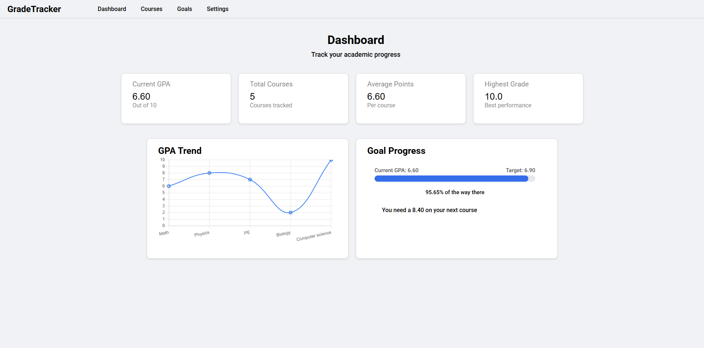

# 📊 Grade Tracker

A simple **Grade Tracker web app** built with **HTML, CSS, and vanilla JavaScript**. It lets you add courses, store grades locally, calculate GPA, and visualize progress — directly in the browser with no backend required.

---

## 🚀 Features

* Add and remove courses
* Automatic GPA calculation
* Visual grade chart
*  Goal / progress tracking
*  Persistent data using `localStorage`
*  Fast, lightweight, no frameworks

---

## 🛠️ Tech Stack

* **HTML** – structure
* **CSS** – layout & styling
* **JavaScript** – logic & DOM manipulation
* **Chart.js** – grade visualization
* **LocalStorage** – data persistence

---

## ▶️ How to Run

1. Clone the repository:

   ```bash
   git clone https://github.com/4ndr3jS/GradeTracker
   ```
2. Open the project folder
3. Double-click `dashboard.html` **or** open it with Live Server

---

## How It Works

* Courses and grades are stored in `localStorage`
* GPA updates automatically when courses change
* Progress bars and charts update dynamically using JavaScript
* Data stays saved even after refreshing the page

---

## Preview



---

## 📜 License

This project is open-source and free to use.

---

## 👤 Author

Built by **Andrej Stanic**
GitHub: [https://github.com/4ndr3jS](https://github.com/4ndr3jS)
